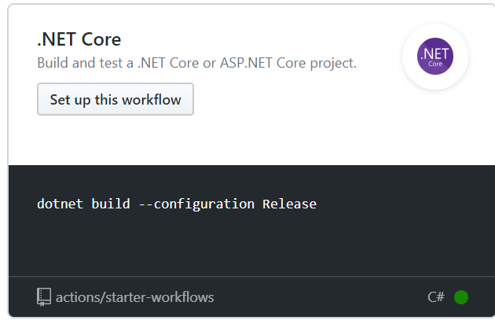
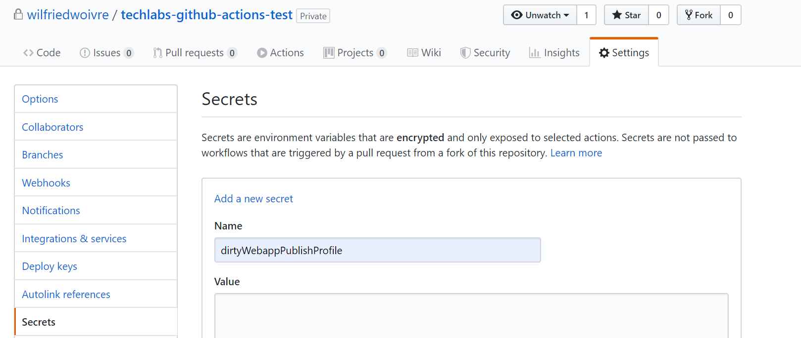

# Hello Github Actions

## Initialiser le workspace

Créer un nouveau dossier `techlabs`, et ouvrir celui-ci dans votre terminal

## Valider les prérequis

Vérifier que vous avez la bonne version de dotnet pour votre lab via la commande suivante :

```bash
dotnet --version
```

Il faut la version `3.0.100`

## Initialiser votre site Web

```bash
dotnet new mvc
```

## Lancer votre site en local

Afin de vérifier que votre site local fonctionne correctement, nous allons le lancer en local via la commande suivante 

```bash
dotnet run
```

Cette commande va compiler votre application puis la lancer en local, par défaut sur l'url : [http://localhost:5000](http://localhost:5000)

Accepter le certificat local afin de vous connecter sur votre site qui ressemblera à celui-ci :


## Créer un repo sur Github

Sur Github, il peut être public ou privé pour ce workshop.

Récupérer l'url du git, nous en aurons besoin un peu plus tard dans ce workshop


## Initialiser votre repository

Commençons par ajouter un gitignore à votre projet, pour cela on va utiliser la commande suivante :

*Via curl :*

```bash
curl -L https://www.gitignore.io/api/dotnetcore -o .gitignore
```

*Via powershell :*

```powershell
(Invoke-WebRequest https://www.gitignore.io/api/dotnetcore).Content | Out-File .gitignore
```

Nous allons ensuite pousser notre code sur notre repository Github fraichement créé.

```bash
git init
git add .
git commit -m "first commit"
git remote add origin https://github.com/.../....git
git push -u origin master
```

## Créer sa première action

Dans votre repository Github fraichement créé qui contient votre code source, vous allez créer votre première action


Dans la liste des actions préconfigurés, chercher l'action suivante et initialiser votre workflow



Votre workflow est en cours d'édition et il contient le yaml suivant :

```yaml
name: .NET Core

on: [push]

jobs:
  build:

    runs-on: ubuntu-latest

    steps:
    - uses: actions/checkout@v1
    - name: Setup .NET Core
      uses: actions/setup-dotnet@v1
      with:
        dotnet-version: 2.2.108
    - name: Build with dotnet
      run: dotnet build --configuration Release
```

Il faut maintenant commit notre nouveau fichier et tester.

Après quelques secondes, vous pouvez voir votre workflow tourner et échouer comme ci-dessous


Récupérer les modifications en local, puis ouvrir le projet dans Visual Studio Code.

```
git fetch --all
git pull
code .
```

## Continuous Integration

### Corriger l'existant

On va commencer par corriger notre workflow afin que celui-ci fonctionne.

Le message d'erreur est le suivant :

```bash
/opt/hostedtoolcache/dncs/2.2.108/x64/sdk/2.2.108/Sdks/Microsoft.NET.Sdk/targets/Microsoft.NET.TargetFrameworkInference.targets(137,5): error NETSDK1045: The current .NET SDK does not support targeting .NET Core 3.0.  Either target .NET Core 2.2 or lower, or use a version of the .NET SDK that supports .NET Core 3.0. [/home/runner/work/techlabs-github-actions-test/techlabs-github-actions-test/techlabs-githubactions.csproj]
```

Pour cela, on va modifier la version de .Net Core dans notre Workflow afin de la passer en `3.0.100`

Ensuite, il vous suffit de push vos modifications afin de les appliquer sur le Workflow dans Github

```bash
git add .
git commit -m "Github Action : Update .Net Core version"
git push -u origin master
```

:trophy: Votre nouvelle build doit donc passer au vert comme ci-dessous :


### Ajout de steps

On va maintenant ajouter des steps à notre premier job.

Commençons par les tests de notre application

```yaml
- name: Test with dotnet
  run: dotnet test --configuration Release
```

Puis lançons une publication sur notre agent que nous utiliserons par la suite

```yaml
- name: Package with dotnet
  run: dotnet publish --configuration Release
```

Pousser vos modifications sur Github pour la suite du workshop

```bash
git add .
git commit -m "Github Action : Add steps test & package"
git push -u origin master
```

### Publier un artifact

Afin de pouvoir publier notre application sur un site Web distant il nous faut un artifact contenant nos binaires, pour cela nous allons utiliser le step `Publish Artifacts` disponible sur la marketplace.


L'action disponible est donc la suivante :

```yaml
- name: Upload artifact
  uses: actions/upload-artifact@v1.0.0
  with:
    # Artifact name
    name: 
    # Directory containing files to upload
    path: 
```

On remplacera la valeur du `path` par **bin/Release/netcoreapp3.0/publish** et la valeur du `name` par **webapp**

Pousser vos modifications sur Github pour la suite du workshop

```bash
git add .
git commit -m "Github Action : Add step upload artifact"
git push -u origin master
```

Sur l'interface de Github, vous pouvez voir votre artifact comme ci-dessous :


## Continuous Deployment

### Création de votre App Service sur Azure

Commençons par créer notre Web App via az cli (vous pouvez utiliser Cloud Shell, si vous n'avez pas les outils installés sur votre poste)

```azurecli-interactive
az group create -n <rg_name> --location westeurope
az appservice plan create -n <plan_name> -g <rg_name> -l westeurope --sku B1
az webapp create -n <app_name> -p <plan_name> -g <rg_name>
```

### Récupération du publishprofile

Sur votre Web App dans le portail Azure, récupérez le publishprofile de votre application


:warning: Attention, ceci n'est pas la meilleure des bonnes pratiques à mettre en place pour de la production, vu que ce fichier contient toutes les données nécessaires pour déployer une application sur votre Web App sans aucun besoin d'accès à votre compte Azure.

### Ajout du publish profile dans Github

Afin de ne mettre votre publish profile en clair dans votre repository, il est possible d'ajouter un secret dans votre repository Github, comme suit :



Pour notre étape de déploiement, nous allons créer un nouveau job avec notre étape de déploiement comme suit :

```yaml
deploy:

    needs: build
    runs-on: ubuntu-latest
    steps:
      - name: Download Artifacts
        uses: actions/download-artifact@master
        with:
          name: webapp
      - name: Deploy to Azure App Service
        uses: azure/appservice-actions/webapp@master
        with:
          app-name: actionsSampleApp
          package: webapp
          publish-profile: ${{ secrets.dirtyWebappPublishProfile }}
```

Après le déploiement votre application Web est disponible sur internet comme suit :


